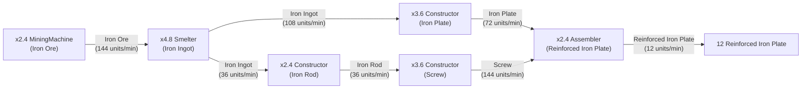

# SatisfactoryTree

A POC project to graph [Satisfactory](https://store.steampowered.com/app/526870/Satisfactory/) items with [D3](https://d3js.org/) [force directed graphs](https://en.wikipedia.org/wiki/Force-directed_graph_drawing). 
Sister project to [http://github.com/samsmithnz/SatisfactoryPlan](http://github.com/samsmithnz/SatisfactoryPlan)

Also has a production calculator that outputs mermaid graphs.

<!--This is very rough. At the very beginning of the game - it looks like this:

After researching some basic items - it's interesting to see what the requirements are to build you initial hub/mall:

At the end of the game, it's a bit busy and I need another visualization:

I have various filtering, to search for specific items, various "ages" of science, and to exclude buildings. For example: This shows all items to build the Gravity Matrix (the green science cube), including alternative/rare material recipes.

-->

Now with images and zoom:

